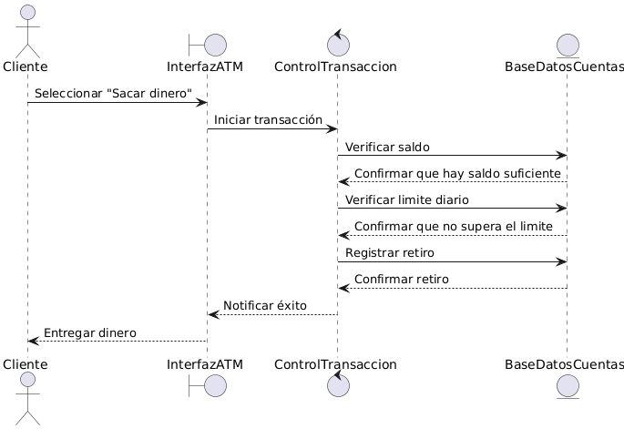
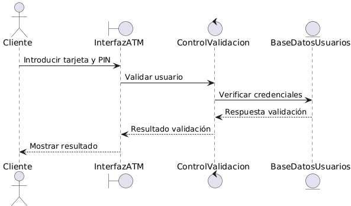
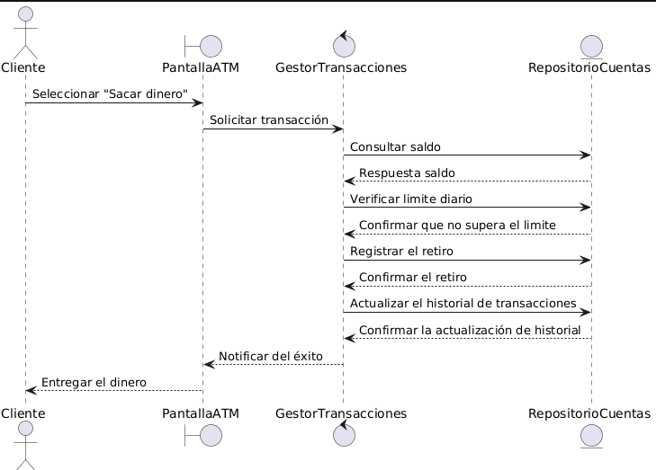
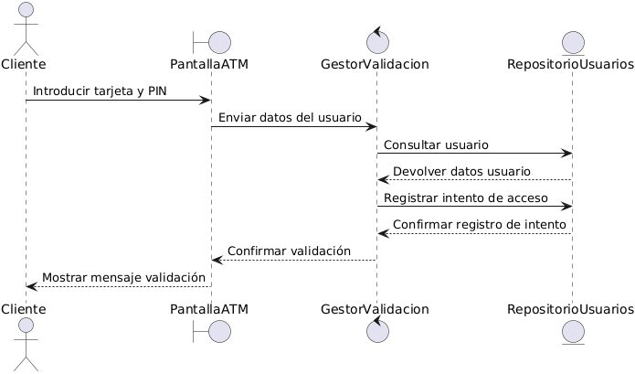

# Diagrama de secuencias
## Secuencias estereotipadas
- Sacar dinero

    

    @startuml
    
    actor Cliente
    
    boundary InterfazATM
    
    control ControlTransaccion
    
    entity BaseDatosCuentas
    
    Cliente -> InterfazATM : Seleccionar "Sacar dinero"
    
    InterfazATM -> ControlTransaccion : Iniciar transacción
    
    ControlTransaccion -> BaseDatosCuentas : Verificar saldo
    
    BaseDatosCuentas --> ControlTransaccion : Confirmar que hay saldo suficiente
    
    ControlTransaccion -> BaseDatosCuentas : Verificar limite diario
    
    BaseDatosCuentas --> ControlTransaccion : Confirmar que no supera el limite
    
    ControlTransaccion -> BaseDatosCuentas : Registrar retiro
    
    BaseDatosCuentas --> ControlTransaccion : Confirmar retiro
    
    ControlTransaccion --> InterfazATM : Notificar éxito
    
    InterfazATM --> Cliente : Entregar dinero
    
    @enduml
  
- Validarse

    
  
    @startuml
    
    actor Cliente
  
    boundary InterfazATM
    
    control ControlValidacion
    
    entity BaseDatosUsuarios
    
    Cliente -> InterfazATM : Introducir tarjeta y PIN
    
    InterfazATM -> ControlValidacion : Validar usuario
    
    ControlValidacion -> BaseDatosUsuarios : Verificar credenciales
    
    BaseDatosUsuarios --> ControlValidacion : Respuesta validación
    
    ControlValidacion --> InterfazATM : Resultado validación
    
    InterfazATM --> Cliente : Mostrar resultado
    
    @enduml

  ## Secuencia final

  - Sacar dinero

    

    @startuml
    
    actor Cliente
    
    boundary PantallaATM
    
    control GestorTransacciones
    
    entity RepositorioCuentas
    
    Cliente -> PantallaATM : Seleccionar "Sacar dinero"
    
    PantallaATM -> GestorTransacciones : Solicitar transacción
    
    GestorTransacciones -> RepositorioCuentas : Consultar saldo
    
    RepositorioCuentas --> GestorTransacciones : Respuesta saldo
    
    GestorTransacciones -> RepositorioCuentas : Verificar limite diario
    
    RepositorioCuentas --> GestorTransacciones : Confirmar que no supera el limite
    
    GestorTransacciones -> RepositorioCuentas : Registrar el retiro
    
    RepositorioCuentas --> GestorTransacciones : Confirmar el retiro
    
    GestorTransacciones -> RepositorioCuentas : Actualizar el historial de transacciones
    
    RepositorioCuentas --> GestorTransacciones : Confirmar la actualización de historial
    
    GestorTransacciones --> PantallaATM : Notificar del éxito
    
    PantallaATM --> Cliente : Entregar el dinero
    
    @enduml

  - Validarse
 
    
   
      @startuml
      
      actor Cliente
      
      boundary PantallaATM
      
      control GestorValidacion
      
      entity RepositorioUsuarios
      
      Cliente -> PantallaATM : Introducir tarjeta y PIN
      
      PantallaATM -> GestorValidacion : Enviar datos del usuario
      
      GestorValidacion -> RepositorioUsuarios : Consultar usuario
      
      RepositorioUsuarios --> GestorValidacion : Devolver datos usuario
      
      GestorValidacion -> RepositorioUsuarios : Registrar intento de acceso
      
      RepositorioUsuarios --> GestorValidacion : Confirmar registro de intento
      
      GestorValidacion --> PantallaATM : Confirmar validación
      
      PantallaATM --> Cliente : Mostrar mensaje validación
      
      @enduml
